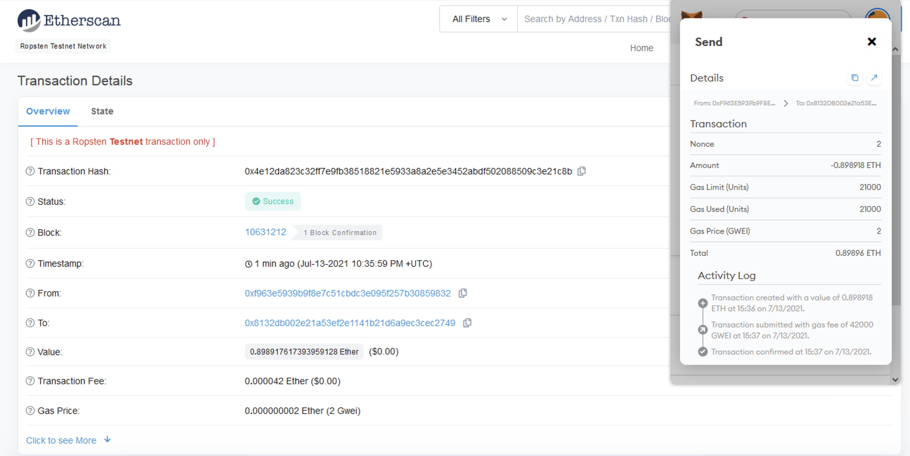

# fintech-solidity-homework

This repository contains smart contracts and transactions as part of the Fintech homework assignment Unit 20 - "Looks like we've made our First Contract!". 

As we have created our own Ethereum-compatible blockchain to help connect financial institutions. In this homework assignment, we build smart contracts to automate some company finances to make everyone's lives easier, increase transparency, and to make accounting and auditing practically automatic. We create three `ProfitSplitter` contracts and these contracts will do following things:
    - Pay oue Associate-level employees quickly and easily.
    - Distribute profits to different tiers of employees.
    - Distribute company shares for employees in a "deferred equity incentive plan" automatically.

## Files

- [AssociateProfitSplitter.sol](./AssociateProfitSplitter.sol)
    - file contains an `AssociateProfitSplitter` contract 
    - accept Ether into the contract and divide the Ether evenly among the associate level employees 
    - allow the Human Resources department to pay employees quickly and efficiently
    For this section, these are the following tasks:
    - navigate to the [Remix IDE](https://remix.ethereum.org)
    - create a new contract called `AssociateProfitSplitter.sol`
    - At the top of our contract, define the following `public` variables:
    * `employee_one` -- The `address` of the first employee `0x8132DB002e21a53Ef2E1141b21d6A9EC3cEC2749`
    * `employee_two` -- Another `address payable` that represents the second employee `0x2Ff44aB9cb2c8A849ECCC9C2d005817d8356d765`
    * `employee_three` -- The third `address payable` that represents the third employee `0x92B04c9b8AE5f7AdF3D17d1E704c966CC6B5Da89`
    - create a constructor function that accepts:
    * `address payable _one`
    * `address payable _two`
    * `address payable _three`
    - create the following functions:
    * `deposit` -- This function should set to `public payable` check, ensuring that only the owner can call the function.
      * In this function, perform the following steps:
       * Set a `uint amount` to equal `msg.value / 3;` in order to calculate the split value of the Ether.
       * Transfer the `amount` to `employee_one`.
       * Repeat the steps for `employee_two` and `employee_three`.
       * Since `uint` only contains positive whole numbers, and Solidity does not fully support float/decimals, we must deal with a potential remainder at the end of this function since `amount` will discard the remainder during division.
       * We may either have `1` or `2` wei leftover, so transfer the `msg.value - amount * 3` back to `msg.sender`. This will re-multiply the `amount` by 3, then subtract it from the `msg.value` to account for any leftover wei, and send it back to Human Resources.
    * Create a fallback function using `function() external payable`, and call the `deposit` function from within it. This will ensure that the logic in `deposit` executes if Ether is sent directly to the contract. This is important to prevent Ether from being locked in the contract since we don't have a `withdraw` function in this use-case.

    

    - amount in addresses that represent `employee_one`, `employee_two`, and `employee_three` before deployment of transaction

    

    - compile the smart contract `AssociateProfitSplitter.sol`

    

    - test the contract
        * In Remix, go to `Deploy` tab, deploy the contract to our local `Ganache` chain by connecting to `Injected Web3` and connect MetaMask to `localhost:8545`

        

        * The smart contract is deployed

        

        * The smart contract executes the deposits

        

        

        * The transaction amounts are reflected in the ledger

        

        

- [TieredProfitSplitter.sol](./TieredProfitSplitter.sol)
    - file contains a `TieredProfitSplitter` contract
    - we calculate rudimentary percentages for different tiers of employees (CEO, CTO, and Bob)

    For this section, these are the following tasks:
    - navigate to `Remix IDE` and create a contract `TieredProfitSplitter.sol`
    - in the contract, these are the following task to perform:
    - create `deposit` function, which perform following tasks:
      * This will allow us to multiply the points with a number representing a percentage. For example, points * 60 will output a number that is ~60% of the msg.value
    - set the amount to equal the number of points multiplied by the percentage (say, 60 for 60%)
    - after calculating the amount for the first employee, add the amount to the total to keep a running total of how much of the msg.value we are distributing so far
    - transfer the amount to employee_one
    - repeat the steps for each employee, setting the amount to equal the points multiplied by their given percentage
    - send the remainder to the employee with the highest percentage by subtracting total from msg.value, and sending that to an employee

    

    - amount in addresses that represent `employee_one`, `employee_two`, and `employee_three` 
    before deployment of transaction

    

    - compile the smart contract `TieredProfitSplitter.sol`

    

    - deploy the smart contract

    
    

    - smart contract executes the deposit

    

    - transaction amounts are reflected in the ledger

    

 
- [DeferredEquityPlan.sol](./DeferredEquityPlan.sol)
    - file contains a `DeferredEquityPlan` contract
    - manage an employee's "deferred equity incentive plan" in which 1000 shares will be distributed over 4 years to the employee
    - `deferred equity incentive plans` -- In this set-up, employees receive shares for joining and staying with the firm. They may receive, for example, an award of 1,000 shares when joining, but with a 4 year vesting period for these shares. This means that these shares would stay with the company, with only 250 shares (1,000/4) actually distributed to and owned by the employee each year. If the employee leaves within the first 4 years, he or she would forfeit ownership of any remaining (“unvested”) shares.
    - store and set amounts that represent the number of distributed shares the employee owns and enforcing the vetting periods automatically

    For the contract, these are the following tasks:
    - in the constructor, `Human Resources` will be set as the `msg.sender`, since HR will be deploying the contract
    - Below the `employee` initialization variables at the top (after `bool active = true`;), set the total shares and annual distribution:
    - create a uint called `total_shares` and set this to `1000`.
    - create another `uint` called `annual_distribution` and set this to `250`. This equates to a 4 year vesting period for the total_shares, as 250 will be distributed per year. Since it is expensive to calculate this in Solidity, we can simply set these values manually. You can tweak them as you see fit, as long as you can divide `total_shares` by `annual_distribution` evenly.
    - `uint start_time = now;` line permanently stores the contract's start date. We'll use this to calculate the vested shares later. Below this variable, set the `unlock_time` to equal `now` plus `365 days`. We will increment each distribution period.
    - `uint public distributed_shares` will track how many vested shares the employee has claimed and was distributed. By default, this is `0`.
    - in the `distribute` function:
    - add the following `require` statements:
        * require that `unlock_time` is less than or equal to `now`.
        * require that `distributed_shares` is less than the `total_shares` the employee was set for.
        * provide `error` messages in require statements.
    - after the `require` statements, add `365 days` to the `unlock_time`. This will calculate next year's unlock time before distributing this year's shares. We want to perform all of our calculations like this before distributing the shares.
    - set the new value for `distributed_shares` by calculating how many years have passed since `start_time` multiplied by `annual_distributions`
    - the final `if` statement provided checks that in case the employee does not cash out until 5+ years after the contract start, the contract does not reward more than the `total_shares` agreed upon in the contract

    - the contracts to a live Testnet

    

    - compile the smart contract `DeferredEquityPlan.sol`

    

    

    - deploy the smart contract

    

    

    - smart contract executes the transaction

    

    

     